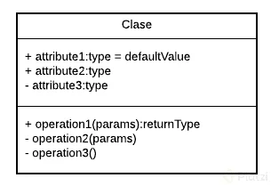
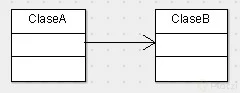
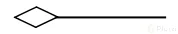
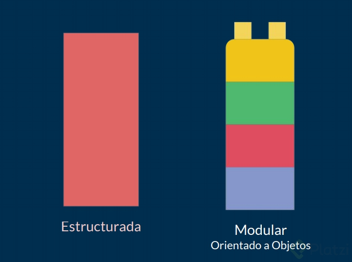
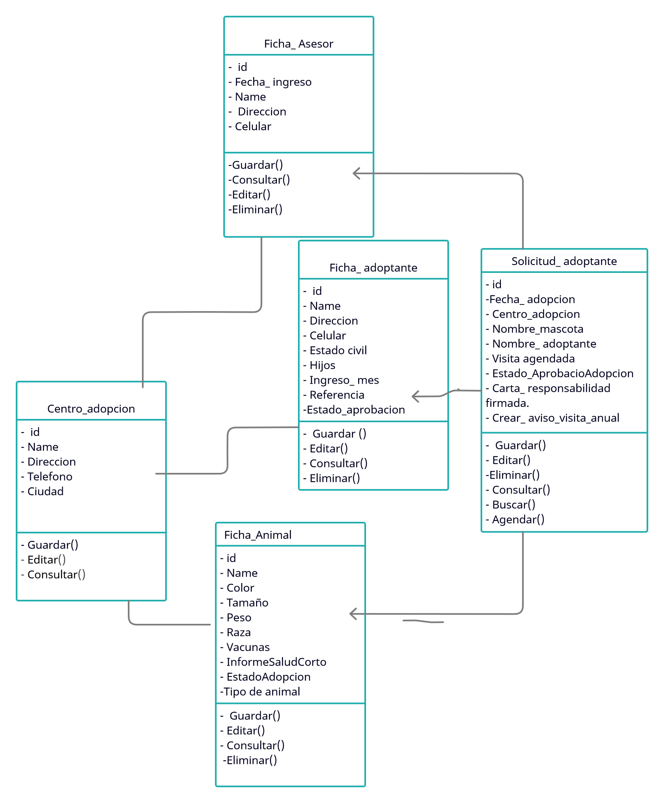

# JAVA POO

- [ POO](#POO)
- [Elementos delParadigmasDeProgramacion](#ElementosParadigmasDeProgramacion)

## POO
ojo: Primero hacer el diagrama de flujo luego hacel el uml ya que es mas detallado
- Nos ayuda a programar mas rapido 
    - Analizar
        Observar, entender y leer muy bien el problema. Empezaré a pensar de forma distinta.
    - Plasmar
        Diseñaré y crearé los diagramas, después de haber realizado el respectivo análisis.

    - Programar
        Programaré nuestro diagrama con cualquier lenguaje que soporte POO.

### Pilares de la programacion orientada a objetos

- Encapsulamiento. Quiere decir que oculta datos mediante código.
- Abstracción. Es como se pueden representar los objetos en modo de código.
- Herencia. Es donde una clase nueva se crea a partir de una clase existente.
- Polimorfismo. Se refiere a la propiedad por la que es posible enviar mensajes sintácticamente iguales a objetos de tipos distintos.

## ElementosParadigmasDeProgramacion
- Clases:

- Propiedades:

- Metodos:

- Objetos:

### diagramas de modelado
- omt : tecina de modelado de objetos

- uml: leguaje de modelado unificado
 - Clases
 - Casos de uso
 - Objetos
 - Actividades
 - Iteracion
 - Estados
 - Implementacion
 - link de un libro de uml (https://es.slideshare.net/still01/aprendiendo-uml-en-24-horas-16815956)
 Las clases se representan así:

- 
- En la parte superior se colocan los atributos o propiedades, y debajo las operaciones de la clase. Notarás que el primer caracter con el que empiezan es un símbolo. Este denotará la visibilidad del atributo o método, esto es un término que tiene que ver con Encapsulamiento y veremos más adelante a detalle.

- Estos son los niveles de visibilidad que puedes tener:

- - private
- + public
- - # protected
~ default

Una forma de representar las relaciones que tendrá un elemento con otro es a través de las flechas en UML, y aquí tenemos varios tipos, estos son los más comunes:

Asociación
- 
Como su nombre lo dice, notarás que cada vez que esté referenciada este tipo de flecha significará que ese elemento contiene al otro en su definición. La flecha apuntará hacia la dependencia.

- 
Con esto vemos que la ClaseA está asociada y depende de la ClaseB.

Herencia
- 
- Siempre que veamos este tipo de flecha se estará expresando la herencia.
- La dirección de la flecha irá desde el hijo hasta el padre.

- 
- Con esto vemos que la ClaseB hereda de la ClaseA

Agregación
- 
- Este se parece a la asociación en que un elemento dependerá del otro, pero en este caso será: Un elemento dependerá de muchos otros. Aquí tomamos como referencia la multiplicidad del elemento. Lo que comúnmente conocerías en Bases de Datos como Relaciones uno a muchos.

- 
- Con esto decimos que la ClaseA contiene varios elementos de la ClaseB. Estos últimos son comúnmente representados con listas o colecciones de datos.

Composición
- 
- Este es similar al anterior solo que su relación es totalmente compenetrada de tal modo que conceptualmente una de estas clases no podría vivir si no existiera la otra.

- 
- Con esto terminamos nuestro primer módulo. Vamos al siguiente para entender cómo podemos hacer un análisis y utilizar estos elementos para construir nuestro diagrama de clases de Uber.

- video para entender mas rapido https://www.youtube.com/watch?v=Z0yLerU0g-Q

## pasos de como resolver un problema y plasmarlos a codigo
- OBJETOS:(Perro)
 - Tienen propiedades y comportamientos 
 - Pueden ser fisicos o conceptuales
 - PROPIEDADES:(nombre, color,raza)
- tambien se consideran atributos
 - Seras sustantivos
 - Nombre, tamaño, forma, estado
- COMPORTAMIENTO:(ladra,come,dormit,correr)
 - Seran toda las operaciones del objeto
 - Suelen ser sustantivos y verbos

- CLASES
 - Me permiten tener mas objetos "mas perritos"
 - son donde costruiremos nuestros objetos

## MODULAR
- modular: Dividir un sistema y así crear módulos independientes, lo que permite evitar un colapso masivo en nuestro código y mejorar la legibilidad.

  - La modularidad nos permite:
  - Reutilizar código
  - Evitar Colapsos
  - Mantenible
  - Legibilidad
  - Resolución Rápida de Problemas
  - - 
        ```php
        Resolviendo con diagrama uml 
        ```
    - 